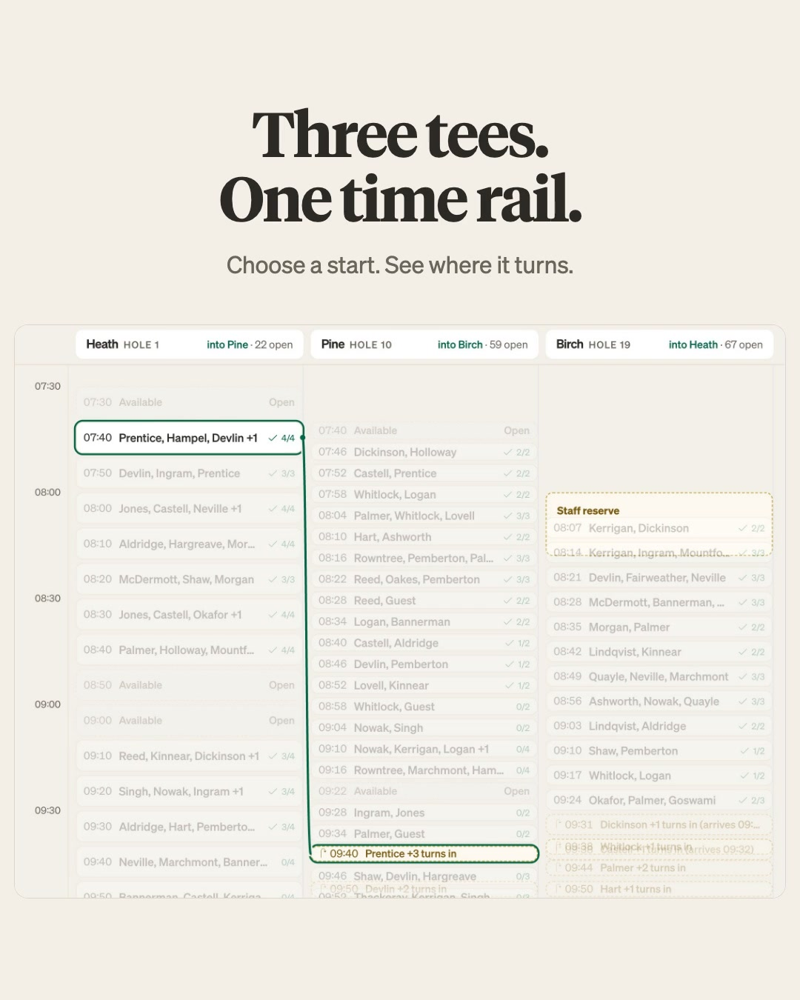
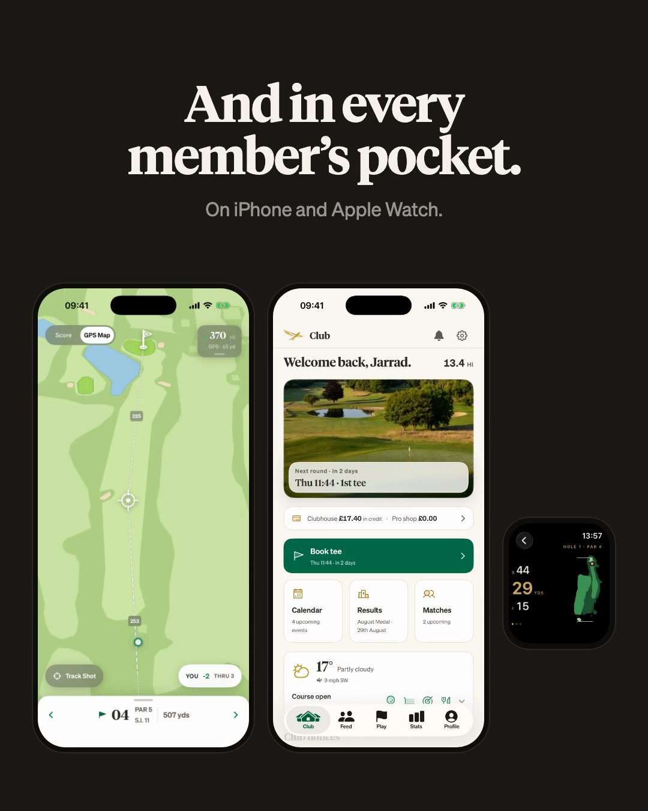

<picture>
  <source media="(prefers-color-scheme: dark)" srcset="assets/header-org-dark.svg">
  
</picture>

**Software for a timeless sport.** One system for your entire club. Tee sheet, competitions, live scoring, member app, wearable connectivity, EPOS, finance. Beautifully integrated.

Built from scratch as one integrated system, not legacy software with bolt-on modules. Your data is hosted in the UK, encrypted, never shared, and exported in full if you ever leave.

<picture>
  <source media="(prefers-color-scheme: dark)" srcset="assets/shipping-org-dark.svg">
  
</picture>

<table>
  <tr>
    <td width="33%"></td>
    <td width="33%"></td>
    <td width="33%"></td>
  </tr>
</table>

### Where it runs

| Surface | What it does |
| --- | --- |
| **ClubOS** | The club's control plane. Tee sheet, competitions, membership, comms, finance. |
| **Member app** | iPhone, Apple Watch and widgets. Scoring, booking, leaderboards. Quiet by design. |
| **EPOS** | The till in the bar and pro shop, on the same member accounts as everything else. |
| **Clubhouse screens** | Live leaderboards and tee boards. |
| **Club website** | Designed and built in-house, sharing one spine with the club system. |

<picture>
  <source media="(prefers-color-scheme: dark)" srcset="assets/languages-dark.svg">
  
</picture>

Founded in 2026 by Jarrad Hicks and Zaheer Merali. Every club deserves software as refined as the sport itself.

[getparalo.com](https://getparalo.com) · [Book a private walkthrough](https://zcal.co/jarradatparalo) · [jarrad@getparalo.com](mailto:jarrad@getparalo.com)
